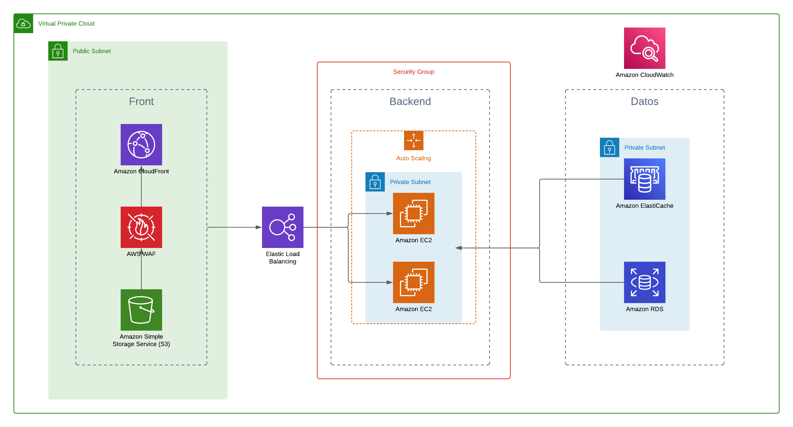

# Despliegue de infraestructura con Python CDK

Para esta solución se asume que el front está desarrollado con un framework basado en Node.js para exportar los archivos estáticos y publicarlos mediante CloudFront y un Bucket de S3.
El back está desarrollado con un framework como Django o spring boot, para desplegarlo de forma sencilla en una máquina Linux, teniendo el autoscaling group para gestionar la cantidad de máquinas necesarias para gestionar los picos de trabajo.

En la base de datos se considera una base de datos relacional PostgreSQL con ElastiCache

Diagrama de infraestructura

En el archivo JFC estimate.pdf se encuentra el costo estimado de la solución

De igual forma en este enlace se encuentra el estimado
https://calculator.aws/#/estimate?id=aaeb8c7222f5cd48d5deba71248486aaa79d557b

